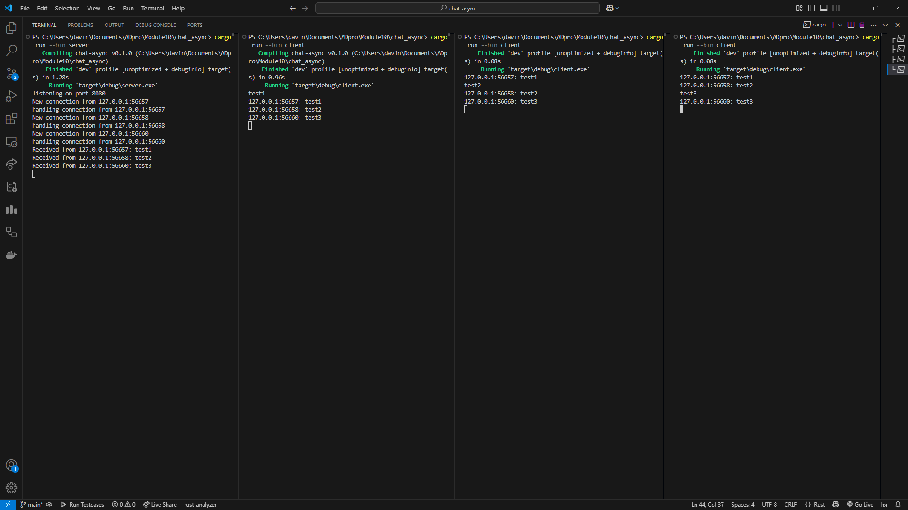

## How it Runs

The way to run this application is to have atleast two terminals open one for the server and the second for the client. To run it the server must be ran first then any reasonable amount of clients. As the server runs and clients begin to start up they will be connected and it will be shown in the server terminal showing which clients connected. Once all connections are established clients can send messages to the server and the server will get the message and resend it to the other clients broadcasting it. Each select loop within each client will then output it in their terminals.

## Modifying port

In this experiment I change the port number from 2000 to 8080 and noticed that the application ran as intended. As long as the port numbers of the server and the clients match it is guranteed to work. Therefore, it is safe to conclude that as long as ports remain the same these changes does not change functionality.